# Multimodal Image Registration Report

This report describes a complete multimodal image registration pipeline for four medical images:

- `MRI_T2.dcm`
- `MRI_DWI.dcm`
- `PET.dcm`
- `MRI_T2_rot.dcm`

The workflow includes image loading, spatial-resolution harmonization, zero padding, exhaustive translation search, exhaustive rotation search, visual assessment with checkerboard overlays, and evaluation through SSD, NCC, and Mutual Information (MI).

## 1. Objective

The goal is to align multiple imaging modalities into a common spatial frame so that anatomical structures can be compared consistently across acquisitions.

Main tasks:

1. Load the DICOM images and inspect size and resolution.
2. Resample floating images to match reference spatial resolution.
3. Apply zero padding to obtain common image size.
4. Estimate best translation for DWI and PET relative to T2.
5. Estimate best rotation for `MRI_T2_rot` relative to `MRI_T2`.
6. Evaluate results using SSD, NCC, and MI.
7. Visualize final alignment with checkerboard overlays and summary figures.

## 2. Reference Image Selection

The T2-weighted MRI image is used as the reference image because:

- it has the highest in-plane resolution,
- it provides detailed anatomy for geometric matching.

### Input image sizes

| Image | Size (pixels) |
| --- | ---: |
| MRI T2 | 512 x 512 |
| MRI DWI | 128 x 128 |
| PET | 128 x 128 |
| MRI T2 Rot | 512 x 512 |

### Pixel spacing

| Image | Pixel spacing (mm) |
| --- | ---: |
| MRI T2 | 0.449 x 0.449 |
| MRI DWI | 1.750 x 1.750 |
| PET | 2.5743 x 2.5743 |
| MRI T2 Rot | 0.449 x 0.449 |

## 3. Resolution Harmonization and Padding

Floating images were resampled to match T2 spacing.

### Scaling factors

- DWI -> T2: `3.8976`
- PET -> T2: `5.7333`

### Image sizes after scaling

| Image | Size after scaling |
| --- | ---: |
| MRI T2 | 512 x 512 |
| MRI DWI (scaled) | 499 x 499 |
| PET (scaled) | 734 x 734 |

After scaling, images were zero-padded to a common field of view.

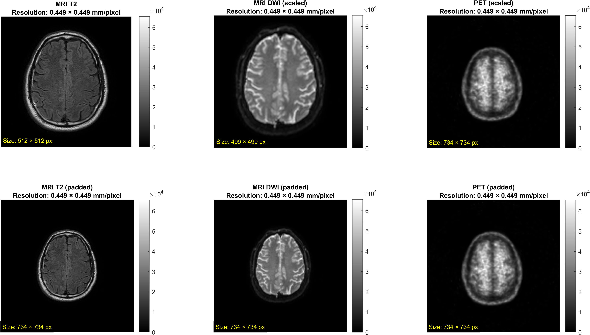

## 4. Translation Registration

Translation registration was performed for:

- T2 vs DWI
- T2 vs PET

Search range:

- `dx, dy in [-20, 20]`

Metrics computed at each shift:

- SSD
- NCC
- MI

Final translation was selected from NCC optimum.

### Best translation-metric values

#### DWI registration

- minimum SSD: `1947122952.0000`
- maximum NCC: `0.9329`
- maximum MI: `0.9518`

#### PET registration

- minimum SSD: `2192681244.0000`
- maximum NCC: `0.9649`
- maximum MI: `0.8851`

### Selected translations

| Floating image | Best translation [x y] (pixels) |
| --- | ---: |
| MRI DWI | `[-1, -1]` |
| PET | `[6, -16]` |

## 5. Translation Registration Assessment

### SSD and NCC heatmaps

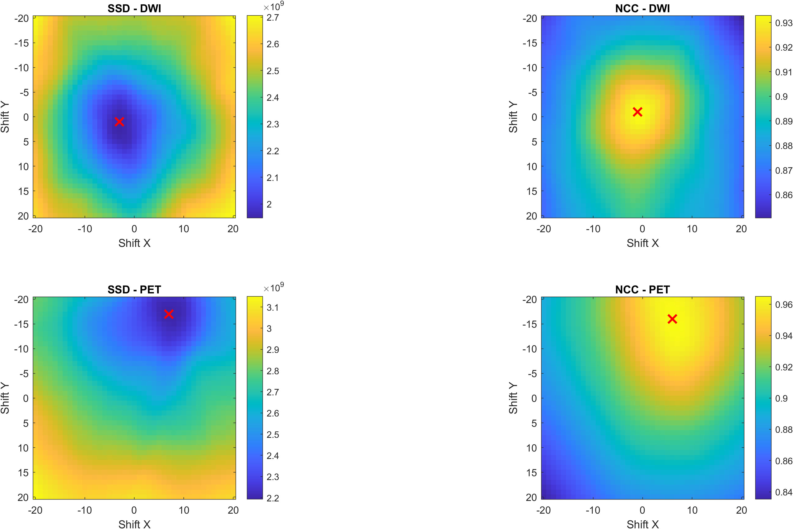

### MI heatmaps

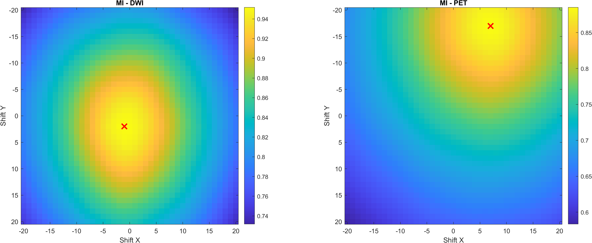

### Checkerboard overlays

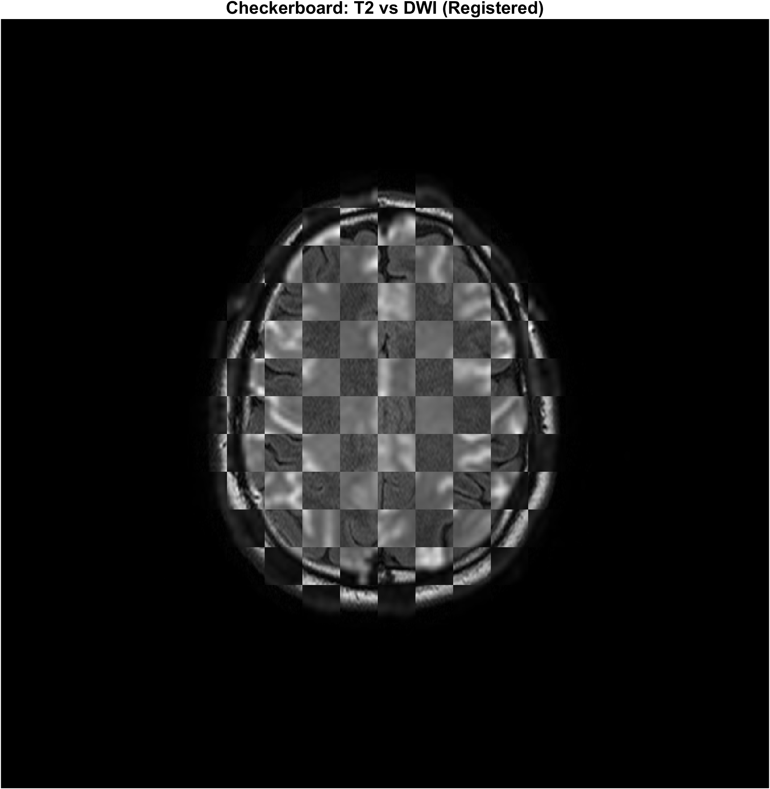

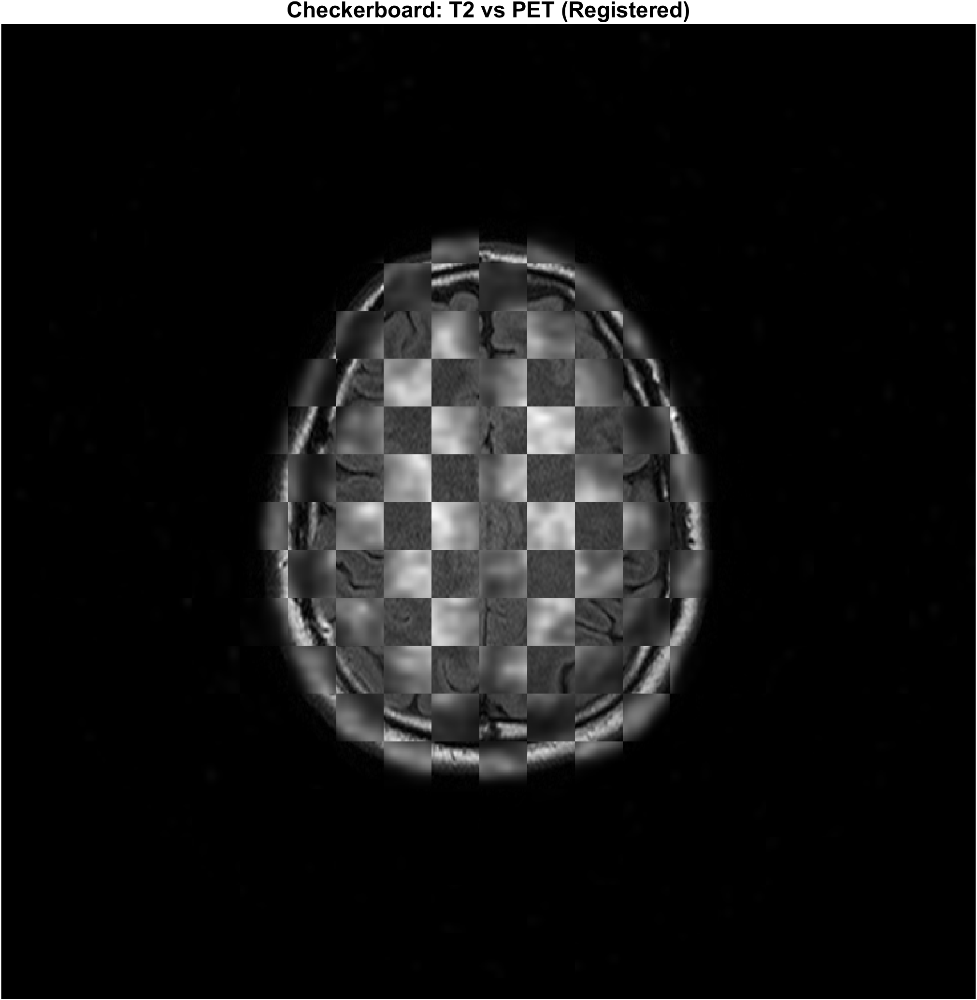

## 6. Rotation Registration

Rotation registration was performed between:

- `MRI_T2.dcm`
- `MRI_T2_rot.dcm`

Angular search:

- range: `0 deg` to `359.5 deg`
- step: `0.5 deg`

All three metrics identified the same optimal angle:

- SSD minimum at `340.00 deg`
- NCC maximum at `340.00 deg`
- MI maximum at `340.00 deg`

### Rotation comparison

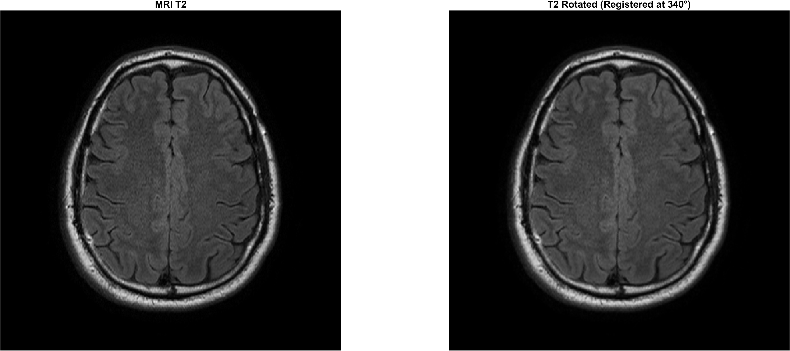

## 7. Rotation Registration Assessment

### Joint histogram after registration

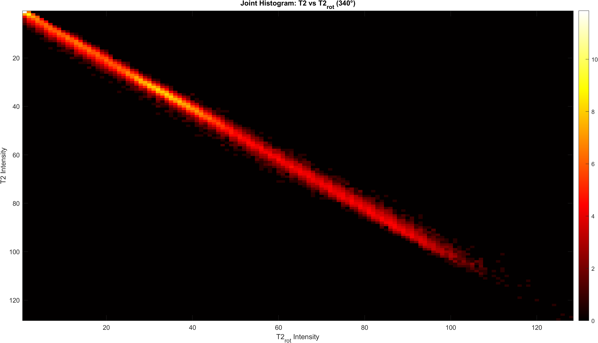

### Checkerboard overlay after rotation correction

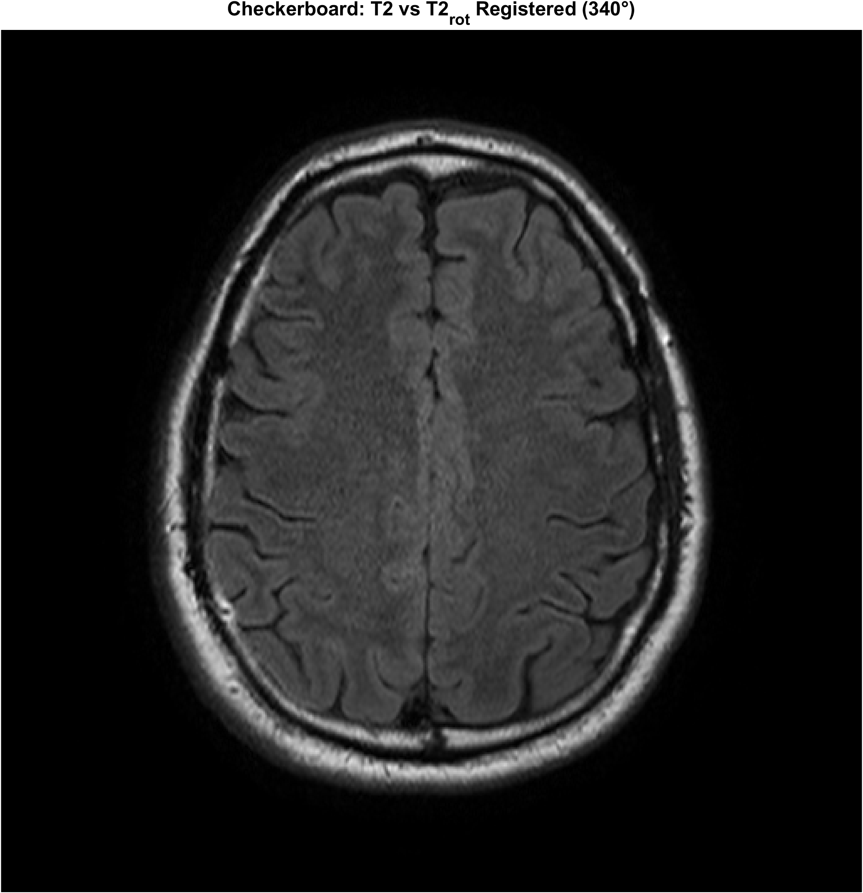

### Metric trends over angle

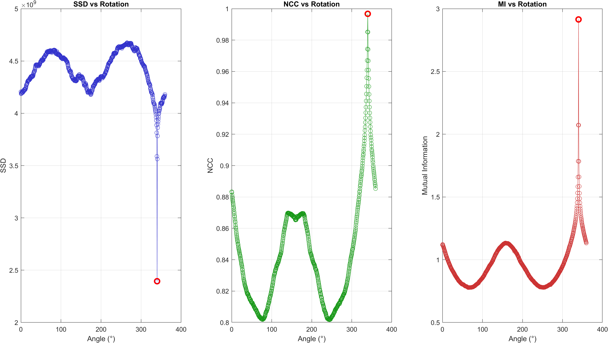

## 8. Final Mutual Information Values

| Registered pair | Final MI |
| --- | ---: |
| T2 vs T2_rot_registered | 2.9144 |
| T2 vs DWI_registered | 0.9471 |
| T2 vs PET_registered | 0.8837 |

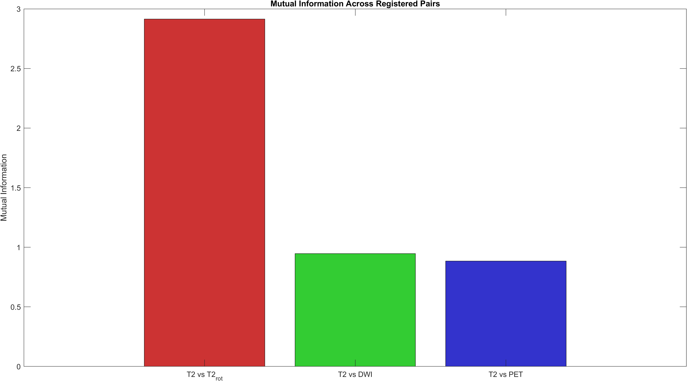

## 9. Automatic Pairwise Registration Reports

### T2 vs DWI

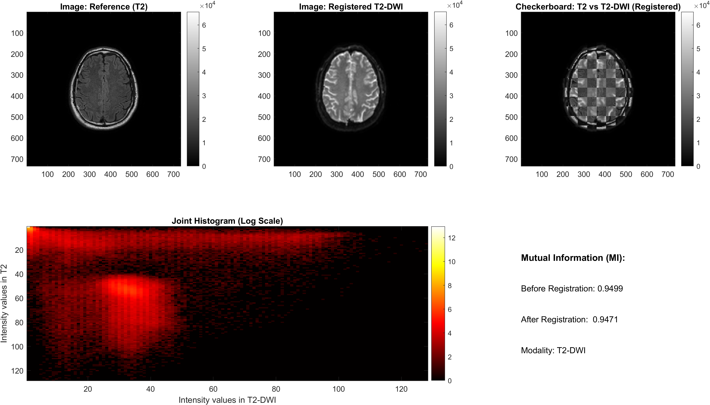

### T2 vs PET

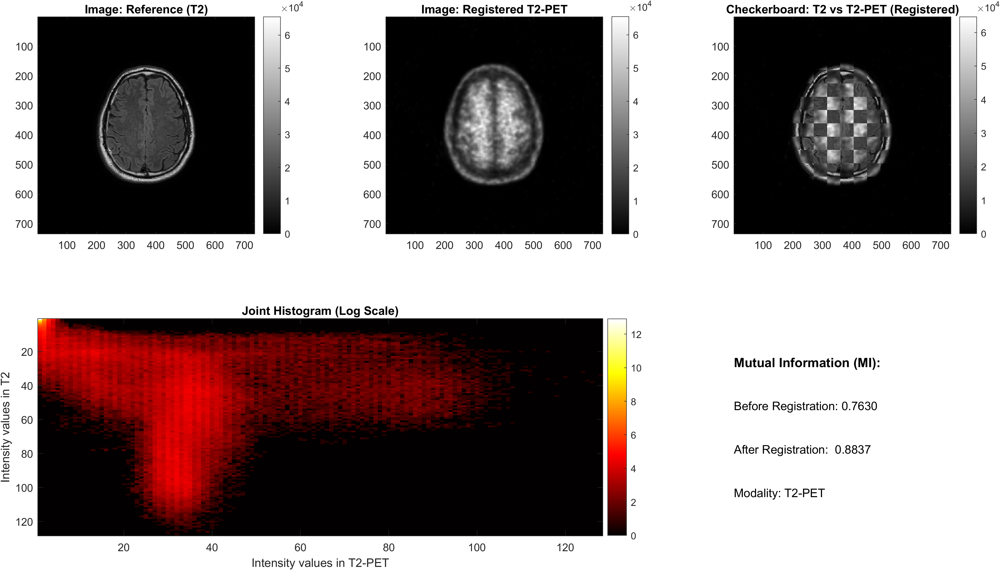

### T2 vs T2rot

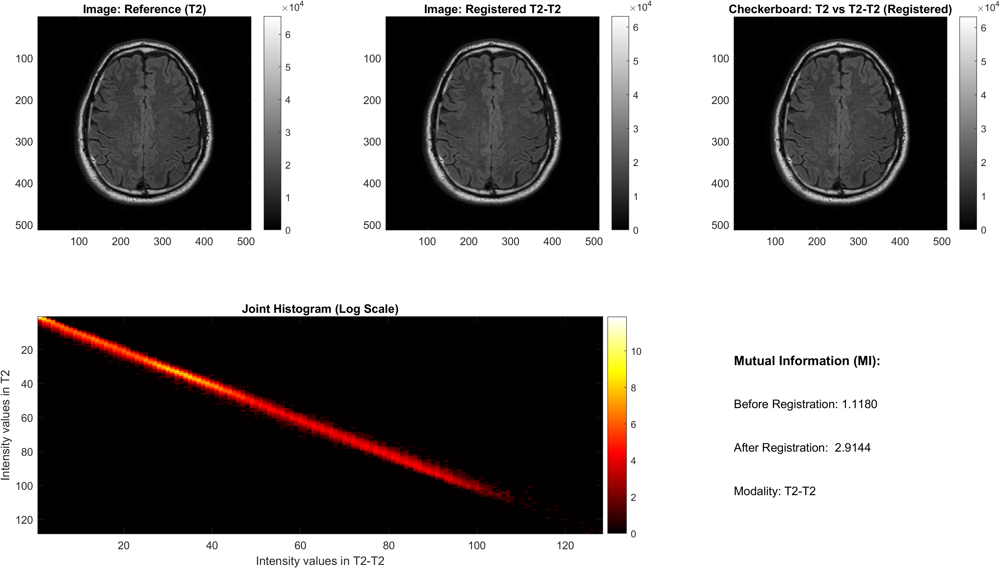

## 10. Final Registration Summary Table

| Image | Scaling factor | Translation [x y] (pixels) | Rotation |
| --- | ---: | ---: | ---: |
| `MR_T2.dcm` | REF | `[0, 0]` | `-` |
| `MRI_DWI.dcm` | 3.8976 | `[-1, -1]` | `-` |
| `PET.dcm` | 5.7333 | `[6, -16]` | `-` |
| `MRI_T2_rot.dcm` | `-` | `-` | `340.00 deg` |

## 11. Files Included

- `Medical_Image_Registration.m` - full MATLAB script for the registration workflow.
- `lib/metrics/SSD.m` - Sum of Squared Differences.
- `lib/metrics/NCC.m` - Normalized Cross Correlation.
- `lib/metrics/MI.m` - Mutual Information.
- `lib/operators/zeroPadding.m` - field-of-view harmonization helper.
- `lib/visualization/checkerboard_view.m` - visual comparison helper.
- `figures/` - full set of exported registration figures.

## 12. Conclusion

The workflow successfully performs multimodal registration between T2, DWI, PET, and rotated T2 images.

Key outcomes:

- T2 was used as the anatomical reference.
- DWI and PET were resampled and padded before translation search.
- Best translations were `[-1, -1]` for DWI and `[6, -16]` for PET.
- Best rotation for `MRI_T2_rot` was `340.00 deg`.
- Heatmaps, checkerboards, and summary reports confirmed good final alignment.
