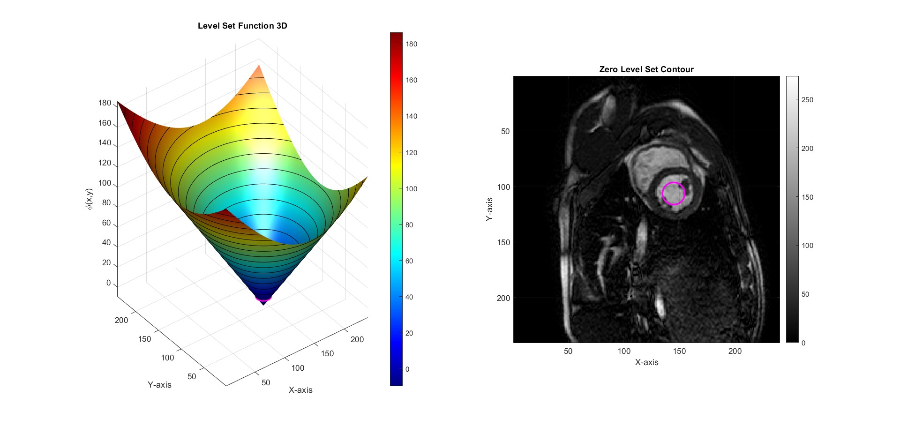
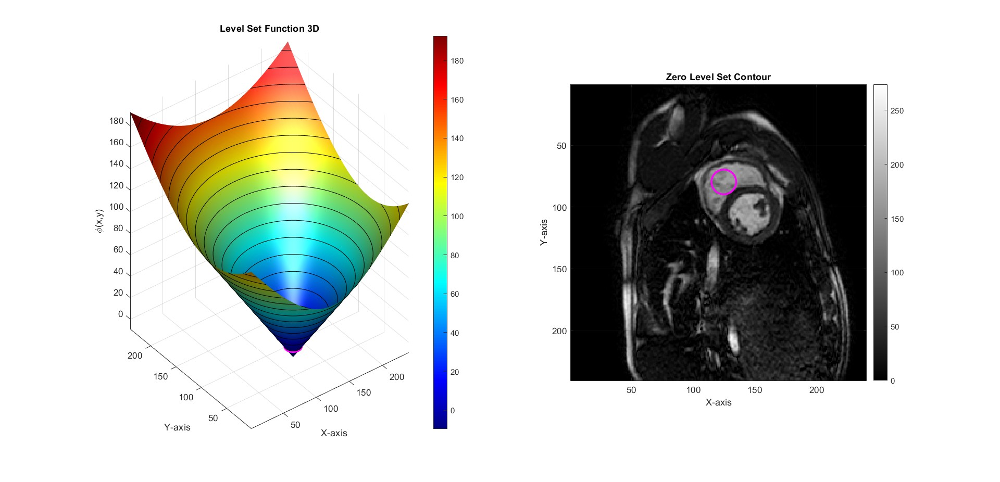
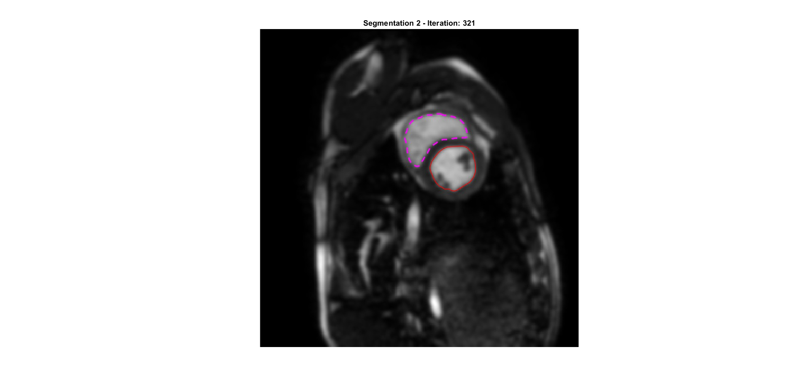
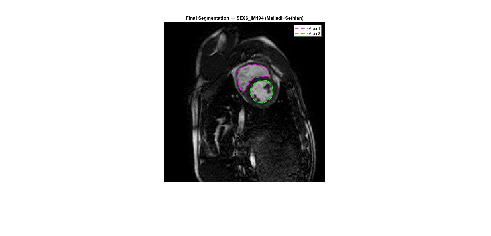

# Ventricle Segmentation Report

This report presents the segmentation of the **left ventricle (LV)** and **right ventricle (RV)** endocardial regions from the short-axis cardiac DICOM image `SE06_IM194`. The segmentation was performed using the **Malladi-Sethian level set model**, an edge-based active contour approach suitable for detecting object boundaries after proper image filtering. The segmented endocardial regions are intended to include trabeculae.

The workflow includes image preprocessing, level set initialization, construction of the edge indicator function, iterative contour evolution, final visualization, and quantitative area estimation.

## 1. Objective

The aim is to segment the **endocardium of the LV and RV** from a short-axis cardiac MRI slice.

Main goals:

1. preprocess the image before edge detection,
2. compute the edge detector `g`,
3. define suitable initial level set functions,
4. implement a stopping criterion,
5. compute segmented areas in physical units.

An edge-based Malladi-Sethian model was selected because, after filtering, ventricular boundaries are sufficiently visible and can be captured by contour evolution driven by curvature regularization and image-gradient information.

## 2. Image Information

The target DICOM image is:

- `SE06_IM194`

Acquisition information:

- image size: determined directly from the DICOM file
- pixel spacing: `1.417 mm x 1.417 mm`

Pixel spacing was used to convert segmented areas from pixels to `mm^2`.

## 3. Preprocessing

Before segmentation, image intensities were normalized to `[0, 1]`:

```matlab
I_norm = (I - min(I(:))) / (max(I(:)) - min(I(:)));
```

To reduce noise while preserving meaningful boundaries, anisotropic diffusion filtering was applied:

- number of iterations: `7`
- time step: `1/7`
- kappa: `7`
- option: `1`

This preprocessing improves stability of edge-based evolution by smoothing homogeneous regions without excessively blurring ventricular borders.

## 4. Level Set Initialization

Two separate level set functions were initialized interactively:

- one for the **LV**
- one for the **RV**

Both initial contours were circular with:

- initialization radius: `10` pixels

Initialization was manually placed inside each ventricular cavity to guide contour evolution toward the correct endocardial boundary.





## 5. Edge Indicator Function

After preprocessing, the edge indicator function `g` was computed from the filtered image:

```matlab
g = 1 ./ (1 + (Grad(I_filt) ./ beta)).^alpha;
```

with:

- `beta = 0.1`
- `alpha = 2`

This function has lower values near strong gradients and acts as a stopping mechanism for the evolving contour near boundaries.

A visualization of the edge indicator and its gradient field was generated to inspect boundary quality.


## 6. Malladi-Sethian Evolution

Ventricular contours were evolved using the Malladi-Sethian formulation:

```matlab
phi = phi + dt * g .* ((eps * K(phi) - 1) .* Grad(phi)) + ni .* Gup(phi, fx, fy);
```

Common parameters:

- maximum iterations: `1500`
- time step: `0.1`
- `eps = 2`

LV evolution parameter:

- balloon term: `ni1 = 2`

RV evolution parameter:

- balloon term: `ni2 = 0.8`

The two regions were segmented independently because they have different geometry and may require different expansion strengths.



## 7. Stopping Criterion

A stopping rule based on segmented area was used.

At each iteration, the number of pixels inside the contour was recorded. Evolution stopped when area remained unchanged compared with 10 iterations earlier:

```matlab
if iter > 140 && area_t(iter) == area_t(iter - 10)
    break;
end
```

This criterion was applied to both LV and RV and indicates contour convergence.

## 8. Left Ventricle Segmentation

The first contour was initialized inside the **LV** and evolved until convergence.

Final LV result:

- final iteration: `334`
- segmented area: `1030 px^2`
- segmented area: `2067.15 mm^2`

## 9. Right Ventricle Segmentation

The second contour was initialized inside the **RV** and evolved separately using a lower balloon-force term.

Final RV result:

- final iteration: `330`
- segmented area: `889 px^2`
- segmented area: `1784.17 mm^2`

## 10. Final Visualization

Final segmentation overlays both contours on the original image:

- **magenta dashed contour**: LV
- **green dashed contour**: RV



## 11. Quantitative Results

Segmented areas were converted to physical units using DICOM pixel spacing.

| Structure | Area (px^2) | Area (mm^2) |
| --- | ---: | ---: |
| Left Ventricle (LV) | 1030 | 2067.15 |
| Right Ventricle (RV) | 889 | 1784.17 |
| Total | - | 3851.33 |

Pixel spacing used:

- `1.417 mm x 1.417 mm`

## 12. Files Included

- `Ventricle_Segmentation.m` - main MATLAB script implementing preprocessing, edge indicator computation, Malladi-Sethian evolution, and area computation
- `figures/` - folder containing the figures used in this report

## 13. Conclusion

The proposed workflow successfully segmented the **LV** and **RV** endocardial regions from `SE06_IM194`. The combination of anisotropic diffusion filtering, edge-indicator construction, interactive level set initialization, and Malladi-Sethian evolution produced stable ventricular contours and enabled quantitative area estimation in `mm^2`.

Overall, the Malladi-Sethian model proved appropriate for this task because ventricular boundaries were sufficiently enhanced after preprocessing, allowing contours to stop near anatomical interfaces of interest.

