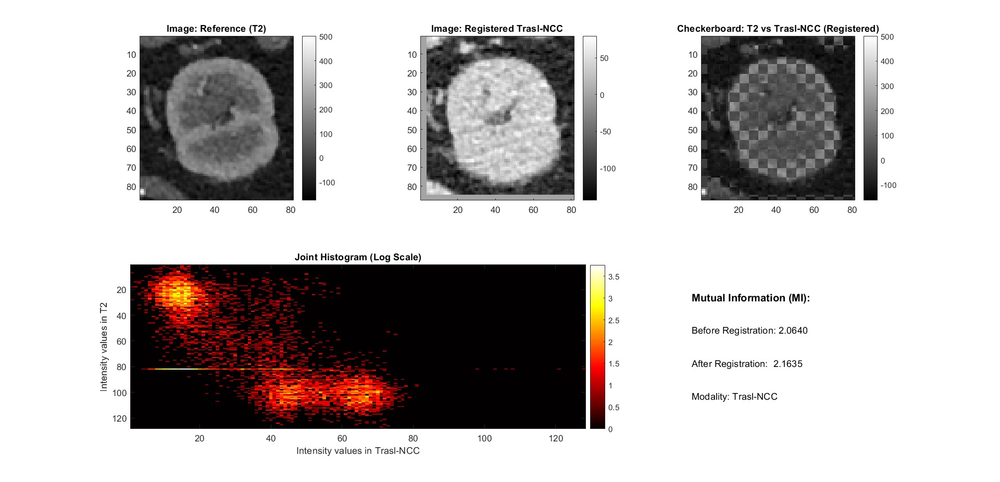
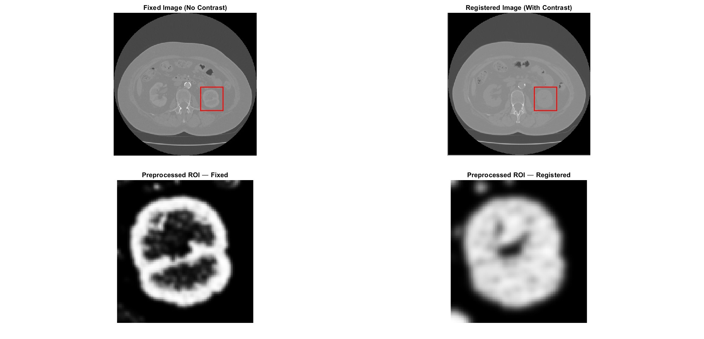
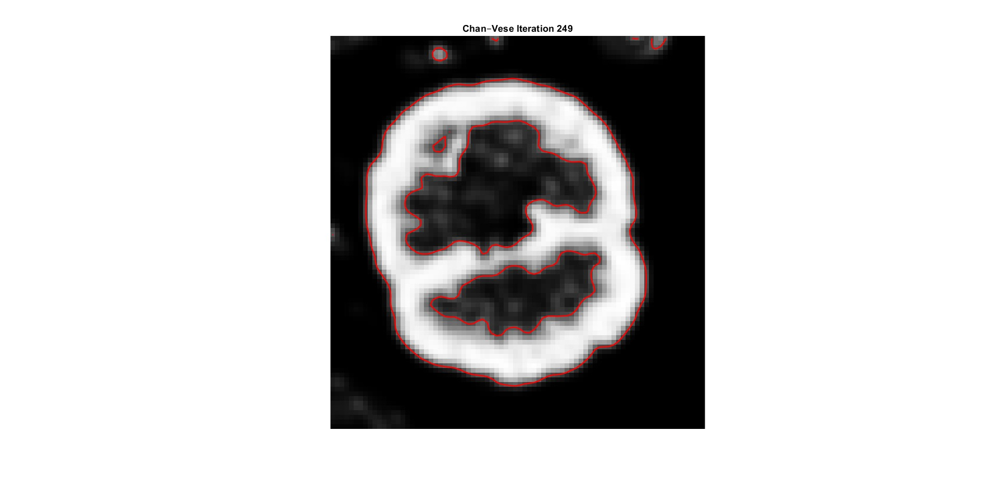
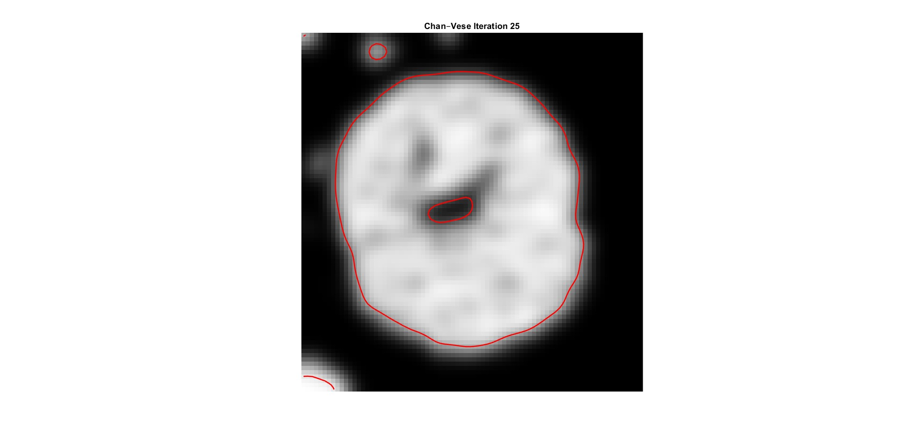
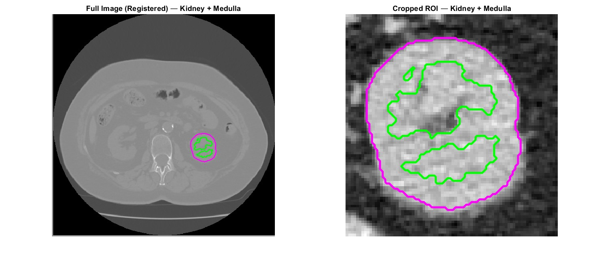
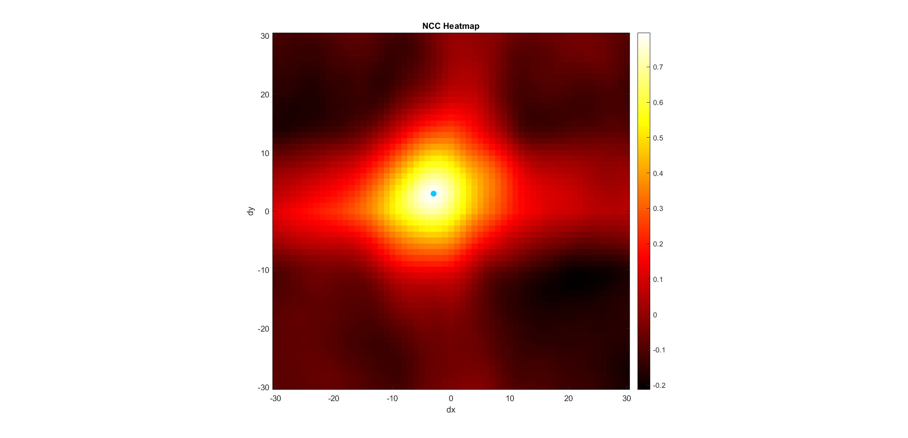

# Kidney Segmentation Report

This report presents the segmentation of the left kidney and its internal structures from two abdominal CT DICOM images. The workflow includes translational image registration, preprocessing, segmentation with the Chan-Vese active contour model, post-processing, visualization, and quantitative area estimation. The images and figures used in this report are stored in the `figures` folder.

## 1. Objective

The goal of this project is to segment the left kidney and, within the detected renal region, identify the medulla and the cortex from the provided DICOM images:

- `IM1883`
- `IM3696`

A Chan-Vese level set approach was selected for this task because it is a region-based segmentation model and does not rely exclusively on strong image edges. This makes it suitable for medical images, where anatomical boundaries may be smooth, partially blurred, or poorly defined.

The complete workflow includes:

1. registration between the two CT acquisitions,
2. selection of a region of interest (ROI) containing the kidney,
3. image preprocessing,
4. kidney segmentation,
5. medulla segmentation,
6. cortex extraction,
7. area quantification.

### Image information

- Image size: `512 x 512` pixels
- Pixel spacing: `0.705 mm x 0.705 mm`

## 2. Registration

Before segmentation, the two CT images were aligned to compensate for small patient micro-movements between acquisitions. A manual ROI was selected, and the relative displacement between the two images was estimated by maximizing the normalized cross-correlation (NCC) inside the selected region.

The computed transformation was a **translation-only registration**, which was then applied to the full moving image.



This step was necessary to ensure a correct spatial overlap between the kidney contour extracted from one acquisition and the internal renal structures visible in the other.

## 3. ROI Selection and Preprocessing

After registration, a second ROI was manually selected around the left kidney in order to restrict the segmentation to the relevant anatomical region and reduce the influence of surrounding tissues.



Two slightly different preprocessing pipelines were applied to improve the segmentation quality:

### 3.1 Preprocessing for kidney segmentation

For the image used to segment the whole kidney, the following steps were performed:

- intensity normalization to the range `[0, 1]`,
- sigmoid intensity enhancement,
- anisotropic diffusion filtering.

The anisotropic diffusion filter reduces noise while preserving relevant anatomical transitions, which helps the Chan-Vese contour evolve more stably.

### 3.2 Preprocessing for medulla segmentation

For the image used to segment the internal renal region, the following steps were applied:

- intensity normalization,
- sigmoid intensity enhancement,
- Gaussian smoothing.

This second preprocessing path was chosen to improve the visibility and homogeneity of the inner renal structures.

## 4. Segmentation Model

Both the kidney and the medulla were segmented using the **Chan-Vese model**. In this formulation, the contour evolves according to curvature regularization and the difference between the image intensity and the mean intensity inside and outside the contour.

A circular level set initialization was manually placed inside the target structure in both cases.

### Kidney segmentation parameters

- maximum iterations: `200`
- time step: `0.1`
- regularization parameter `mu = 0.5`
- data terms: `lambda1 = 30`, `lambda2 = -30`
- initialization radius: `30` pixels

### Medulla segmentation parameters

- maximum iterations: `250`
- time step: `0.1`
- regularization parameter `mu = 0.5`
- data terms: `lambda1 = 50`, `lambda2 = -50`
- initialization radius: `5` pixels

## 5. Stopping Criterion

A stopping condition based on the evolution of the segmented area was introduced for both structures.

At each iteration, the number of pixels inside the evolving contour was recorded. Convergence was assumed when the relative variation of the segmented area over 10 iterations became sufficiently small.

- **Kidney segmentation:** stop when the relative area variation falls below `0.01`
- **Medulla segmentation:** stop when the relative area variation falls below `0.001`

This stopping rule prevents unnecessary iterations once the contour becomes stable and provides a robust stopping term.

## 6. Kidney Segmentation

The whole kidney was segmented first using the preprocessed registered image. The contour was initialized inside the renal region and evolved iteratively until convergence.

After evolution, the binary kidney mask was refined through:

- morphological reconstruction from the selected seed point,
- hole filling.

These operations removed disconnected regions and produced a cleaner final kidney mask.



## 7. Medulla Segmentation

The medulla was segmented inside the same ROI using the second preprocessed image and a smaller initialization radius.

After the Chan-Vese evolution, connected components were labeled and filtered. Since the raw segmentation could include multiple internal regions, a heuristic post-processing step based on connected-component area ranking was used to retain the most plausible internal structures corresponding to the medulla.



## 8. Cortex Extraction

The cortex was obtained indirectly by subtracting the medulla mask from the whole kidney mask:

**Cortex = Kidney - Medulla**

This is consistent with the anatomical interpretation of the kidney as an outer cortical region surrounding the inner medullary structures.

## 9. Final Visualization

The final kidney and medulla contours were overlaid on both:

- the full registered image,
- the cropped ROI.

The selected color convention was:

- **magenta** for the kidney,
- **green** for the medulla.



For completeness, the NCC heatmap used during registration is also reported below.



## 10. Area Quantification

The area of each segmented structure was computed by counting the number of pixels in the corresponding binary mask and multiplying by the pixel area:

```matlab
Area = nnz(mask) * prod(pixel_spacing)
```

The cortex area was computed as:

```matlab
area_cortex = area_kidney - area_medulla
```

### Final computed areas

| Region | Area (mm^2) |
| --- | ---: |
| Kidney | 1489.58 |
| Medulla | 532.31 |
| Cortex (Kidney - Medulla) | 957.27 |

## 11. Files Included

- `kidney_segmentation.m` - main MATLAB script implementing registration, preprocessing, Chan-Vese segmentation, and area computation
- `figures/` - folder containing the figures used in this report

## 12. Conclusion

The proposed workflow successfully segmented the left kidney and its internal structures from the provided CT images. The combination of translational registration, dedicated preprocessing, Chan-Vese level set evolution, and post-processing produced a coherent final result and allowed quantitative estimation of kidney, medulla, and cortex areas.

Overall, the Chan-Vese model proved appropriate for this task because it can segment anatomical regions even when boundaries are not sharply defined, which is a common condition in medical imaging.


