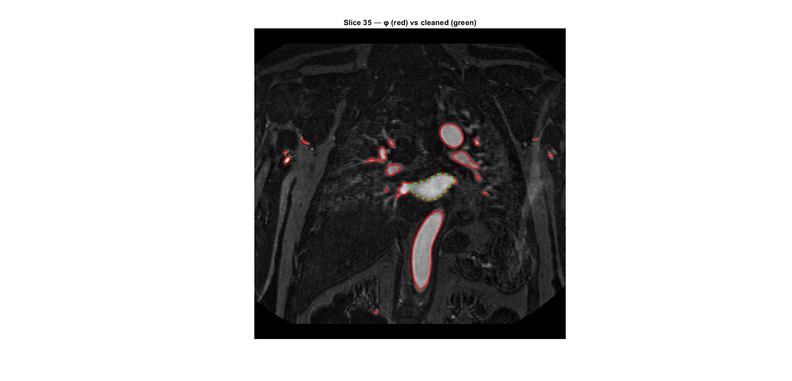
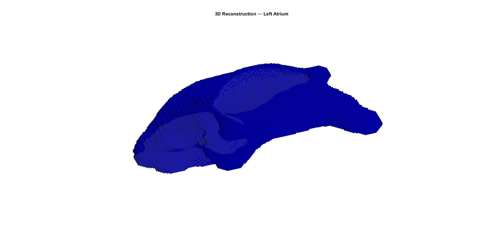

# 3D Left Atrium Segmentation Report

This report presents the **3D segmentation of the left atrium (LA)** from the cardiac MRI volume stored in `patient5.mat`. The workflow is based on a **slice-by-slice Chan-Vese level set approach** and includes volume loading, per-slice preprocessing, interactive initialization, contour evolution, post-processing, quantitative area and volume estimation, and final 3D mesh reconstruction.

The report reflects the MATLAB implementation and presents the final quantitative results in a clear, self-contained form.

## 1. Objective

The goal is to segment the **left atrium** from a 3D cardiac MRI dataset and reconstruct its 3D shape for quantitative analysis.

More specifically, the workflow aims to:

1. identify the slices in which the left atrium is visible,
2. segment the atrium on each selected slice,
3. refine the raw segmentation masks,
4. compute the atrial area on each slice,
5. estimate the total atrial volume in physical units,
6. reconstruct a 3D surface mesh of the segmented structure.

A **Chan-Vese active contour model** was selected because it is a region-based method and is well suited to MRI data, where anatomical boundaries may be weak, non-uniform, or partially ambiguous.

## 2. Dataset and Volume Information

Input data are loaded from:

- `data/patient5.mat`

The MATLAB structure contains:

- `res.imm` -> 3D MRI volume
- `res.info.ps` -> in-plane pixel spacing `[dy, dx]` in mm
- `res.info.st` -> slice thickness in mm

Acquisition information:

- volume dimensions: `576 x 576 x 47`
- pixel spacing: `0.692 x 0.692 mm`
- slice thickness: `1.500 mm`

These physical parameters are used to convert pixel-based measurements into `mm^2` and `mm^3`.

## 3. Slice Selection

Although the exercise refers to slices `8-35`, the current MATLAB implementation processes:

- `slice_range = 9:35`

This corresponds to **27 slices**, focusing analysis on the portion where the left atrium is clearly visible.

## 4. Preprocessing

Each selected slice is processed independently before segmentation.

### 4.1 Intensity normalization

For every slice, intensity values are normalized to `[0, 1]`:

```matlab
I_slice = (I_slice - min(I_slice(:))) / (max(I_slice(:)) - min(I_slice(:)));
```

### 4.2 Anisotropic diffusion filtering

To reduce noise while preserving anatomical transitions, anisotropic diffusion filtering is applied with:

- `num_iter = 5`
- `delta_t = 0.1`
- `kappa = 15`
- `option = 2`

This step improves level set stability by smoothing homogeneous regions without excessively blurring atrial boundaries.

## 5. Segmentation Model

Segmentation is performed using the **Chan-Vese level set model**.

This method evolves a contour according to curvature regularization and intensity statistics inside and outside the contour. It is suitable here because the left-atrium boundary is not always defined by strong edges.

Chan-Vese parameters:

- `mu = 0.5`
- `lambda1 = 30`
- `lambda2 = -30`
- `ni = 0.0`
- `time_step = 1`
- `epsilon = 1e-6`
- `max_iterations = 100`
- `check_interval = 5`
- `init_radius = 3`

## 6. Slice-by-Slice Segmentation Workflow

Segmentation is applied independently to each slice in the selected range.

### 6.1 Interactive center selection

A center point inside the atrium is selected interactively and updated every:

- `update_center_every_n_slices = 10`

In the current run, selected centers were:

- slice 9 -> `(361, 323)`
- slice 19 -> `(346, 323)`
- slice 29 -> `(326, 297)`

### 6.2 Level set initialization

For each slice, the level set function is initialized as a small circular region centered on the selected point.

### 6.3 Evolution and stopping criterion

At each iteration, contour area is tracked. Convergence is assumed when relative area variation over `check_interval` iterations becomes sufficiently small:

```matlab
delta_area = abs(area_track(iter) - area_track(iter - check_interval)) / (area_track(iter) + epsilon);

if delta_area < 0.01
    break;
end
```

This stopping rule avoids unnecessary iterations after contour stabilization.

## 7. Post-Processing

After raw Chan-Vese evolution, morphological refinement is applied per slice:

1. erosion with a disk structuring element,
2. connected-component labeling,
3. selection of the component containing the clicked seed,
4. dilation,
5. hole filling.

In the implementation:

- `strel('disk', 9)`

Final cleaned binary masks are stored in `PHI_bin`, while raw level set functions are stored in `PHI`.

## 8. Quantitative Results

### 8.1 Per-slice area

Per-slice atrial area is computed as:

```matlab
area_mm2(s) = sum(mask_clean(:)) * pixel_spacing(1) * pixel_spacing(2);
```

Areas from current execution:

| Slice | Area (mm^2) |
| --- | ---: |
| 9  | 1985.70 |
| 10 | 2078.68 |
| 11 | 2111.27 |
| 12 | 2172.62 |
| 13 | 2248.35 |
| 14 | 2420.41 |
| 15 | 2550.30 |
| 16 | 2686.42 |
| 17 | 2917.44 |
| 18 | 3143.18 |
| 19 | 3223.23 |
| 20 | 3304.23 |
| 21 | 3637.81 |
| 22 | 3497.38 |
| 23 | 3290.33 |
| 24 | 3096.69 |
| 25 | 2884.85 |
| 26 | 2715.18 |
| 27 | 2616.92 |
| 28 | 2557.01 |
| 29 | 2476.97 |
| 30 | 2277.59 |
| 31 | 2129.01 |
| 32 | 1959.82 |
| 33 | 1777.21 |
| 34 | 1561.05 |
| 35 | 1185.28 |

### 8.2 Volume computation

Total atrial volume is computed as:

```matlab
volume_mm3 = sum(area_mm2) * slice_thickness;
```

Final quantitative summary:

| Quantity | Value |
| --- | ---: |
| Number of segmented slices | 27 |
| Minimum slice area (mm^2) | 1185.28 |
| Maximum slice area (mm^2) | 3637.81 |
| Total segmented volume (mm^3) | 102757.37 |

## 9. Visualization

The script generates two visualization levels.

### 9.1 Slice-by-slice overlay

For each segmented slice:

- raw level set contour `phi = 0` in **red**
- cleaned mask contour in **green dashed**



### 9.2 Final 3D reconstruction

After all slices are segmented, a 3D mesh is generated from the binary volume using:

- `binsurface` for surface extraction,
- coordinate scaling with pixel spacing and slice thickness,
- `plotmesh` for rendering.

## 10. 3D Mesh Reconstruction

The 3D surface mesh is obtained from `PHI_bin`.

After extraction, mesh nodes are scaled as:

- `x` multiplied by `pixel_spacing(2)`
- `y` multiplied by `pixel_spacing(1)`
- `z` multiplied by `slice_thickness`

This preserves anatomical proportions in millimetric units.

Final rendering uses:

- hidden mesh edges,
- semi-opaque blue surface,
- equal axis scaling,
- 3D illumination (`camlight`).



## 11. Files Included

- `Left_Atrium_Segmentation.m` - main MATLAB script for slice-by-slice segmentation and 3D reconstruction
- `figures/left_atrium_segmentation.jpg` - representative segmentation overlay
- `figures/3d_reconstruction_left_atrium.jpg` - final 3D mesh visualization

## 12. Conclusion

The workflow successfully segments the **left atrium** from the provided cardiac MRI volume and reconstructs its 3D shape. The combination of per-slice preprocessing, Chan-Vese evolution, morphological refinement, and physical scaling supports both qualitative visualization and quantitative analysis.

In the current execution, the estimated **left-atrium volume** is:

- **102757.37 mm^3**

Overall, Chan-Vese proved appropriate for this dataset because it remains robust even when atrial boundaries are not uniformly sharp across slices.
