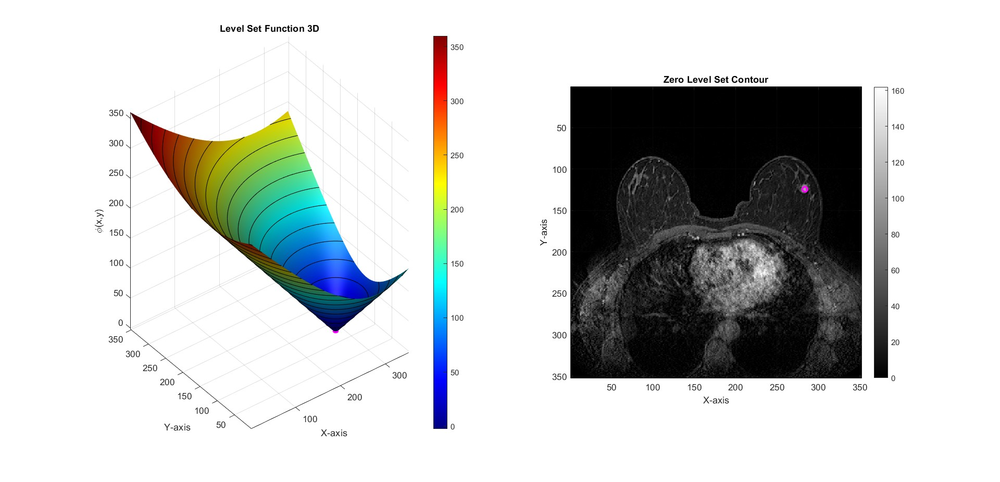
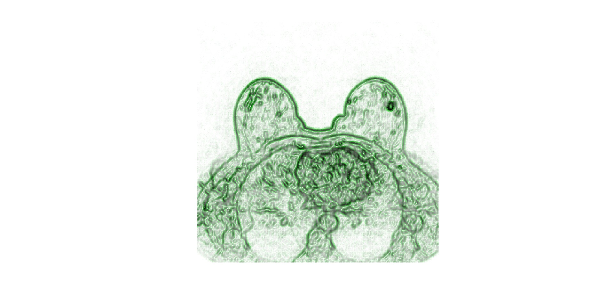
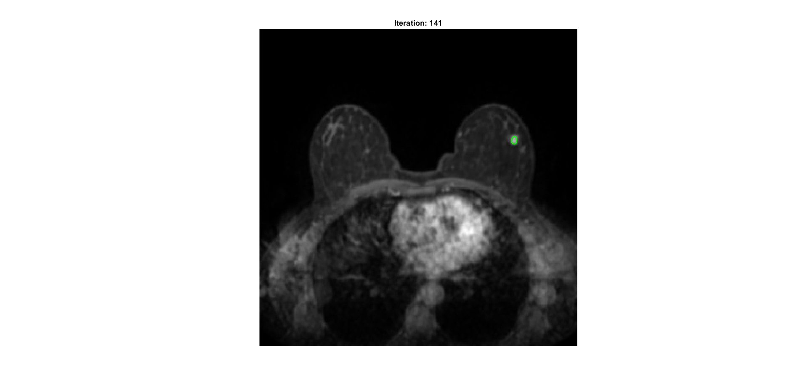
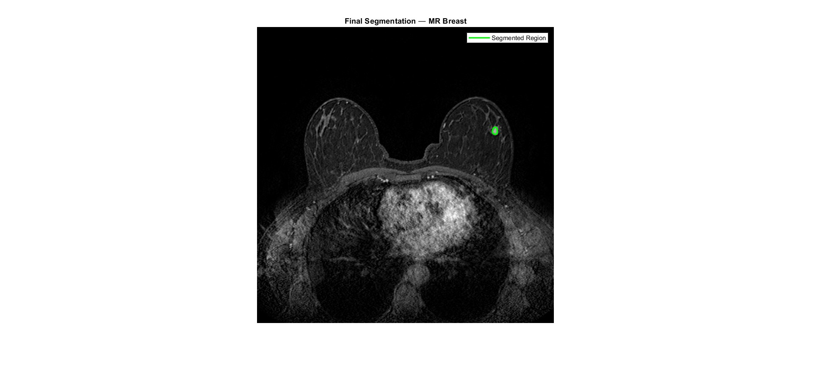

# MR Breast Lesion Segmentation Report

This report presents the segmentation of the lesion visible in the contrast-enhanced breast MR image `MR_breast`. The workflow is based on the **Malladi-Sethian level set model**, an edge-based active contour method that combines curvature regularization with image-gradient information to detect object boundaries.

The complete pipeline includes image loading, preprocessing, interactive level set initialization, computation of the edge indicator function, iterative contour evolution, final contour overlay, and quantitative area estimation.

## 1. Objective

The goal is to detect the contour of the breast lesion indicated in the provided MR image and estimate its area in physical units.

More specifically, the implemented workflow performs:

1. preprocessing of the input image before edge detection,
2. computation of the edge indicator function `g`,
3. initialization of the level set function `phi`,
4. contour evolution with a stopping criterion,
5. final area computation in **mm^2**.

An **edge-based Malladi-Sethian formulation** was selected because the lesion boundary becomes sufficiently distinguishable after filtering, allowing the evolving contour to stop near the relevant anatomical interface.

## 2. Image Information

The target DICOM image is:

- `MR_breast`

The image metadata extracted from the DICOM header are:

- image size: `352 x 352` pixels
- pixel spacing: `0.966 x 0.966 mm`

The pixel spacing is used to convert segmented area from pixels to physical units.

## 3. Preprocessing

Before segmentation, the image is normalized and smoothed in order to improve robustness of edge-based evolution.

### 3.1 Intensity normalization

The MR image is normalized to `[0, 1]`:

```matlab
I_norm = (I - min(I(:))) / (max(I(:)) - min(I(:)));
```

### 3.2 Anisotropic diffusion filtering

To reduce noise while preserving relevant lesion boundaries, anisotropic diffusion filtering is applied with:

- `num_iter = 7`
- `delta_t = 1/7`
- `kappa = 7`
- `option = 1`

The filtered image is stored in `I_filt`.

This preprocessing stage improves contour stability by smoothing homogeneous regions without excessively blurring the lesion edge.

## 4. Level Set Initialization

The initial level set function is generated interactively by selecting a point inside the lesion and creating a small circular initialization.

Initialization settings:

- initialization mode: interactive center selection
- initial radius: `3` pixels
- inside convention: negative inside the contour (`InsidePositive = false`)

This initialization provides the starting region for subsequent level set evolution.



## 5. Edge Indicator Function

After preprocessing, the **edge indicator function** is computed as:

```matlab
g = 1 ./ (1 + (Grad(I_filt) ./ beta)).^alpha;
```

with:

- `beta = 0.1`
- `alpha = 2`

The function `g` takes lower values near strong image gradients and therefore acts as a stopping mechanism for the evolving contour close to the lesion boundary.

For qualitative inspection, the script also visualizes:

- the scalar map of `g`,
- the vector field associated with its spatial derivatives.



## 6. Malladi-Sethian Evolution

The lesion contour is evolved using the Malladi-Sethian update:

```matlab
phi = phi + dt * g .* ((eps * K(phi) - 1) .* Grad(phi)) + Gup(phi, fx, fy);
```

where:

- `K(phi)` is the curvature term,
- `Grad(phi)` is the gradient magnitude of the level set function,
- `Gup(phi, fx, fy)` is the upwind term driven by the gradient of the edge indicator.

Evolution parameters:

- maximum iterations: `1500`
- time step: `dt = 0.1`
- curvature weight parameter: `eps = 3`

The derivatives of the edge indicator are computed as:

```matlab
fx = Dx(g);
fy = Dy(g);
```



## 7. Stopping Criterion

During evolution, segmented area is monitored at every iteration:

```matlab
A = phi < 0;
area_track(i) = sum(A(:));
```

The process is stopped when segmented area remains unchanged with respect to the value observed 10 iterations earlier, after an initial stabilization period:

```matlab
if i > 140 && area_track(i) == area_track(i - 10)
    break;
end
```

This provides a simple convergence criterion indicating that the contour has reached a stable configuration.

## 8. Quantitative Results

At the end of evolution, segmented area is computed from the final binary region and converted to physical units using DICOM pixel spacing:

```matlab
area_mm2 = finalArea * ps(1) * ps(2);
```

Final segmentation results:

| Quantity | Value |
| --- | ---: |
| Final iteration | 141 |
| Segmented area (px^2) | 44 |
| Segmented area (mm^2) | 41.05 |
| Pixel spacing (mm) | 0.966 x 0.966 |

These values indicate that the lesion occupies a relatively small region, consistent with the localized enhancement visible in the image.

## 9. Final Visualization

The final result is displayed by overlaying the zero level set contour `phi = 0` on the original MR image.

Display convention:

- original breast MR image in grayscale
- final lesion contour in **green**

This visualization makes it possible to assess whether the detected contour correctly follows the lesion boundary indicated in the exercise figure.



## 10. Files Included

- `MR_Breast_Segmentation.m` - main MATLAB script for lesion segmentation
- `report.md` - project report
- figure files generated from the MATLAB script and included in the repository folder

## 11. Conclusion

The workflow successfully segments the lesion in the contrast-enhanced MR breast image using a **Malladi-Sethian level set approach**. The combination of normalization, anisotropic diffusion filtering, edge-indicator construction, and iterative contour evolution produces a compact final contour and enables direct quantitative area estimation.

In the current execution, the final lesion area is:

- **41.05 mm^2**

Overall, the Malladi-Sethian model is appropriate for this task because the lesion appears as a localized structure with a sufficiently informative gradient profile after preprocessing, making an edge-based segmentation strategy effective.

